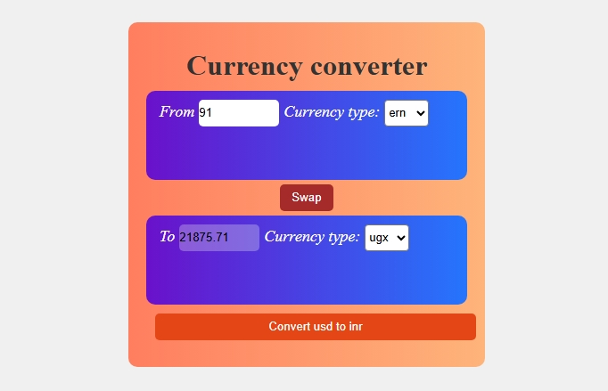

# 💱 Currency Converter Using React

A simple and functional currency converter built using **React**, **custom hooks**, and **live exchange rates** from [Fawaz Ahmed's Currency API](https://github.com/fawazahmed0/currency-api). This tool allows users to convert between INR and other currencies, with an intuitive swap function and a minimal UI design. 
# Live demo: 
https://ip-tracker-q18v.onrender.com

### 🔗 Live API Used

- `https://cdn.jsdelivr.net/npm/@fawazahmed0/currency-api@latest/v1/currencies/inr.json`

---

## 📂 Folder Structure

This project is located inside the `/vitepractice` directory of the repo.

currency-converter-using-react-/
├── vitepractice/
│ ├── src/
│ ├── public/
│ ├── package.json
│ └── ...
├── README.md
└── ...

yaml
Copy
Edit

---

## 🚀 Features

- Fetches real-time exchange rates using a custom React hook (`useFetchRates`)
- Allows currency conversion from INR to selected currencies
- Swap functionality for switching input and output currencies
- Clean and simple UI using basic CSS
- Built with modern React (`useEffect`, `useState`, `useId`)

---

## 🛠️ Tech Stack

- React (with Hooks)
- Vite (for fast build and dev server)
- JavaScript (ES6+)
- Basic CSS
- [Fawaz Currency API](https://github.com/fawazahmed0/currency-api)

---


## 📦 Installation & Running Locally

Follow the steps below to clone and run the project on your machine.

```bash
# 1. Clone the repository
git clone https://github.com/Kushdeveloper68/currency-converter-using-react-.git

# 2. Navigate into the project directory
cd currency-converter-using-react-/vitepractice

# 3. Install dependencies
npm install

# 4. Start the development server
npm run currency
The app should now be running at http://localhost:5173 (or the port Vite provides).

🔄 Swap Feature
Clicking the Swap button switches the selected input and output currencies, along with their values. This enhances the user experience when converting back and forth.


🙌 Acknowledgements
Fawaz Ahmed's Currency API

React and Vite communities

🧑‍💻 Author
Kush Pandit

📄 License
This project is open source and available under the MIT License.

